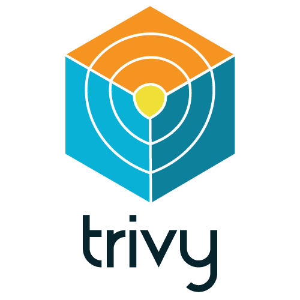

# Trivy by Aqua security

- Trivy: [https://www.aquasec.com/products/trivy/](https://www.aquasec.com/products/trivy/)
- Source: [https://github.com/thecyberbaby/Trivy-by-aquaSecurity](https://github.com/thecyberbaby/Trivy-by-aquaSecurity)

## Introduction

- Trivy is a comprehensive, easy-to-use open source vulnerability scanner for container images. Since its introduction two years ago, the project has gained a broad following among open source community members. 

- I’m excited to share that it has now become the first container image vulnerability scanner to surpass 8,000 GitHub stars, making it the world's leading scanner.

- Unlike other open source scanners, Trivy covers both OS packages and language-specific dependencies and is easy to integrate into organizations’ software development pipelines.


## Features

- Comprehensive vulnerability detection
  - OS packages (Alpine Linux, Red Hat Universal Base Image, Red Hat Enterprise Linux, CentOS, Oracle Linux, Debian, Ubuntu, Amazon Linux, openSUSE Leap, SUSE Enterprise Linux, Photon OS and Distroless)
  - **Language-specific packages** (Bundler, Composer, Pipenv, Poetry, npm, yarn, Cargo, NuGet, Maven, and Go)

- Misconfiguration detection (IaC scanning) 
  - A wide variety of built-in policies are provided **out of the box**
    - Kubernetes, Docker, Terraform, and more coming soon
  - Support custom policies

- Simple
  - Specify only an image name, a path to config files, or an artifact name

- Fast
  - The first scan will finish within 10 seconds (depending on your network). Consequent scans will finish in single seconds.

- Easy installation
  - `apt-get install`, `yum install` and `brew install` are possible.
  - **No pre-requisites** such as installation of DB, libraries, etc.

- High accuracy
  - **Especially [Alpine Linux][alpine] and RHEL/CentOS**
  - Other OSes are also high

- DevSecOps
  - **Suitable for CI** such as GitHub Actions, Jenkins, GitLab CI, etc.

- Support multiple targets
  - container image, local filesystem and remote git repository


## Installation

Please refer the official documentation for [installation](https://aquasecurity.github.io/trivy/v0.20.2/getting-started/installation/).

<p align="center">
    
</p>


### Quick start

scan image for vulnerabilities

      $ trivy image [YOUR_IMAGE_NAME]

For example :

      $ trivy image python:3.4-alpine

<details>
<summary>Result</summary>

```
2019-05-16T01:20:43.180+0900    INFO    Updating vulnerability database...
2019-05-16T01:20:53.029+0900    INFO    Detecting Alpine vulnerabilities...

python:3.4-alpine3.9 (alpine 3.9.2)
===================================
Total: 1 (UNKNOWN: 0, LOW: 0, MEDIUM: 1, HIGH: 0, CRITICAL: 0)

+---------+------------------+----------+-------------------+---------------+--------------------------------+
| LIBRARY | VULNERABILITY ID | SEVERITY | INSTALLED VERSION | FIXED VERSION |             TITLE              |
+---------+------------------+----------+-------------------+---------------+--------------------------------+
| openssl | CVE-2019-1543    | MEDIUM   | 1.1.1a-r1         | 1.1.1b-r1     | openssl: ChaCha20-Poly1305     |
|         |                  |          |                   |               | with long nonces               |
+---------+------------------+----------+-------------------+---------------+--------------------------------+
```
</details>

### Scan Directory for Misconfigurations

Simply specify a directory containing IaC files such as Terraform and Dockerfile.

```
$ trivy config [YOUR_IAC_DIR]
```

For example:

```
$ ls build/
Dockerfile
$ trivy config ./build
```

<details>
<summary>Result</summary>

```
2021-07-09T10:06:29.188+0300    INFO    Need to update the built-in policies
2021-07-09T10:06:29.188+0300    INFO    Downloading the built-in policies...
2021-07-09T10:06:30.520+0300    INFO    Detected config files: 1

Dockerfile (dockerfile)
=======================
Tests: 23 (SUCCESSES: 22, FAILURES: 1, EXCEPTIONS: 0)
Failures: 1 (UNKNOWN: 0, LOW: 0, MEDIUM: 0, HIGH: 1, CRITICAL: 0)

+---------------------------+------------+----------------------+----------+------------------------------------------+
|           TYPE            | MISCONF ID |        CHECK         | SEVERITY |                 MESSAGE                  |
+---------------------------+------------+----------------------+----------+------------------------------------------+
| Dockerfile Security Check |   DS002    | Image user is 'root' |   HIGH   | Last USER command in                     |
|                           |            |                      |          | Dockerfile should not be 'root'          |
|                           |            |                      |          | -->avd.aquasec.com/appshield/ds002       |
+---------------------------+------------+----------------------+----------+------------------------------------------+
```

</details>

Standalone architecture

<p align="center">
    
</p>

Client Server architecture

<p align="center">
    
</p>


#   Refer this official repository for explore  [Trivy Action](https://github.com/aquasecurity/trivy-action)