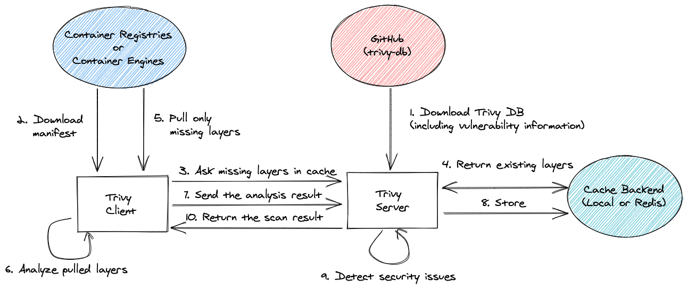

# Trivy by Aqua security

- Trivy: [https://www.aquasec.com/products/trivy/](https://www.aquasec.com/products/trivy/)
- Source: [https://github.com/thecyberbaby/Trivy-by-aquaSecurity](https://github.com/thecyberbaby/Trivy-by-aquaSecurity)

### Introduction

- Trivy is a comprehensive, easy-to-use open source vulnerability scanner for container images. Since its introduction two years ago, the project has gained a broad following among open source community members.

- **A Trivy scan inspects your Dockerfile’s base image to find unresolved vulnerabilities that your containers will inherit. 
Trivy can also look at operating system packages and source code dependencies added via popular package managers.**

**Trivy has three scan types: container, Git repository, and filesystem directory.**

- I’m excited to share that it has now become the first container image vulnerability scanner to surpass 8,000 GitHub stars, making it the world's leading scanner.

- Unlike other open source scanners, Trivy covers both OS packages and language-specific dependencies and is easy to integrate into organizations’ software development pipelines.


### Easy installation
  - `apt-get install`, `yum install` and `brew install` are possible.
  - **No pre-requisites** such as installation of DB, libraries, etc.

  - **Suitable for CI** such as GitHub Actions, Jenkins, GitLab CI, etc.

- Support multiple targets
  - container image, local filesystem and remote git repository


### Installation

Please refer the official documentation for [installation](https://aquasecurity.github.io/trivy/v0.20.2/getting-started/installation/).

<p align="center">
    
</p>


### Quick start

scan image for vulnerabilities

      $ trivy image [YOUR_IMAGE_NAME]

For example :

      $ trivy image python:3.4-alpine

<details>
<summary>Result</summary>

```
2019-05-16T01:20:43.180+0900    INFO    Updating vulnerability database...
2019-05-16T01:20:53.029+0900    INFO    Detecting Alpine vulnerabilities...

python:3.4-alpine3.9 (alpine 3.9.2)
===================================
Total: 1 (UNKNOWN: 0, LOW: 0, MEDIUM: 1, HIGH: 0, CRITICAL: 0)

+---------+------------------+----------+-------------------+---------------+--------------------------------+
| LIBRARY | VULNERABILITY ID | SEVERITY | INSTALLED VERSION | FIXED VERSION |             TITLE              |
+---------+------------------+----------+-------------------+---------------+--------------------------------+
| openssl | CVE-2019-1543    | MEDIUM   | 1.1.1a-r1         | 1.1.1b-r1     | openssl: ChaCha20-Poly1305     |
|         |                  |          |                   |               | with long nonces               |
+---------+------------------+----------+-------------------+---------------+--------------------------------+
```
</details>

### Scan Directory for Misconfigurations

Simply specify a directory containing IaC files such as Terraform and Dockerfile.

```
$ trivy config [YOUR_IAC_DIR]
```

For example:

```
$ ls build/
Dockerfile
$ trivy config ./build
```

<details>
<summary>Result</summary>

```
2021-07-09T10:06:29.188+0300    INFO    Need to update the built-in policies
2021-07-09T10:06:29.188+0300    INFO    Downloading the built-in policies...
2021-07-09T10:06:30.520+0300    INFO    Detected config files: 1

Dockerfile (dockerfile)
=======================
Tests: 23 (SUCCESSES: 22, FAILURES: 1, EXCEPTIONS: 0)
Failures: 1 (UNKNOWN: 0, LOW: 0, MEDIUM: 0, HIGH: 1, CRITICAL: 0)

+---------------------------+------------+----------------------+----------+------------------------------------------+
|           TYPE            | MISCONF ID |        CHECK         | SEVERITY |                 MESSAGE                  |
+---------------------------+------------+----------------------+----------+------------------------------------------+
| Dockerfile Security Check |   DS002    | Image user is 'root' |   HIGH   | Last USER command in                     |
|                           |            |                      |          | Dockerfile should not be 'root'          |
|                           |            |                      |          | -->avd.aquasec.com/appshield/ds002       |
+---------------------------+------------+----------------------+----------+------------------------------------------+
```

</details>

### Standalone architecture

<p align="center">
    
</p>

### Client Server architecture

<p align="center">
    
</p>


   Trivy Server

      nishant@i3:~/Desktop/Docker$ trivy server
      2021-10-29T18:34:36.757+0530  INFO  Need to update DB
      2021-10-29T18:34:36.757+0530  INFO  Downloading DB...
      2021-10-29T18:34:49.222+0530  INFO  Listening localhost:4954...
      2021-10-29T18:35:48.313+0530  INFO  Detected OS: alpine
      2021-10-29T18:35:48.313+0530  INFO  Detecting Alpine vulnerabilities...
      2021-10-29T18:35:48.313+0530  INFO  Number of language-specific files: 0

   Trivy Client

      nishant@i3:~/Desktop/Docker$ trivy client alpine:3.10.2

<details>
<summary>Result</summary>

```
2021-10-29T18:35:48.317+0530  WARN  This OS version is no longer supported by the distribution: alpine 3.10.2
2021-10-29T18:35:48.317+0530  WARN  The vulnerability detection may be insufficient because security updates are not provided

alpine:3.10.2 (alpine 3.10.2)
=============================
Total: 28 (UNKNOWN: 0, LOW: 4, MEDIUM: 14, HIGH: 9, CRITICAL: 1)

+--------------+------------------+----------+-------------------+---------------+---------------------------------------+
|   LIBRARY    | VULNERABILITY ID | SEVERITY | INSTALLED VERSION | FIXED VERSION |                 TITLE                 |
+--------------+------------------+----------+-------------------+---------------+---------------------------------------+
| apk-tools    | CVE-2021-36159   | CRITICAL | 2.10.4-r2         | 2.10.7-r0     | libfetch before 2021-07-26, as        |
|              |                  |          |                   |               | used in apk-tools, xbps, and          |
|              |                  |          |                   |               | other products, mishandles...         |
|              |                  |          |                   |               | -->avd.aquasec.com/nvd/cve-2021-36159 |
+              +------------------+----------+                   +---------------+---------------------------------------+
|              | CVE-2021-30139   | HIGH     |                   | 2.10.6-r0     | In Alpine Linux apk-tools             |
|              |                  |          |                   |               | before 2.12.5, the tarball            |
|              |                  |          |                   |               | parser allows a buffer...             |
|              |                  |          |                   |               | -->avd.aquasec.com/nvd/cve-2021-30139 |
+--------------+------------------+          +-------------------+---------------+---------------------------------------+
| busybox      | CVE-2021-28831   |          | 1.30.1-r2         | 1.30.1-r5     | busybox: invalid free or segmentation |
|              |                  |          |                   |               | fault via malformed gzip data         |
|              |                  |          |                   |               | -->avd.aquasec.com/nvd/cve-2021-28831 |
+--------------+------------------+          +-------------------+---------------+---------------------------------------+
| libcrypto1.1 | CVE-2020-1967    |          | 1.1.1c-r0         | 1.1.1g-r0     | openssl: Segmentation                 |
|              |                  |          |                   |               | fault in SSL_check_chain              |
|              |                  |          |                   |               | causes denial of service              |
|              |                  |          |                   |               | -->avd.aquasec.com/nvd/cve-2020-1967  |
+              +------------------+          +                   +---------------+---------------------------------------+
|              | CVE-2021-23840   |          |                   | 1.1.1j-r0     | openssl: integer                      |
|              |                  |          |                   |               | overflow in CipherUpdate              |
|              |                  |          |                   |               | -->avd.aquasec.com/nvd/cve-2021-23840 |
+              +------------------+          +                   +---------------+---------------------------------------+
|              | CVE-2021-3450    |          |                   | 1.1.1k-r0     | openssl: CA certificate check         |
|              |                  |          |                   |               | bypass with X509_V_FLAG_X509_STRICT   |
|              |                  |          |                   |               | -->avd.aquasec.com/nvd/cve-2021-3450  |
+              +------------------+----------+                   +---------------+---------------------------------------+
|              | CVE-2019-1547    | MEDIUM   |                   | 1.1.1d-r0     | openssl: side-channel weak            |
|              |                  |          |                   |               | encryption vulnerability              |
|              |                  |          |                   |               | -->avd.aquasec.com/nvd/cve-2019-1547  |
+              +------------------+          +                   +               +---------------------------------------+
|              | CVE-2019-1549    |          |                   |               | openssl: information                  |
|              |                  |          |                   |               | disclosure in fork()                  |
|              |                  |          |                   |               | -->avd.aquasec.com/nvd/cve-2019-1549  |
+              +------------------+          +                   +---------------+---------------------------------------+
|              | CVE-2019-1551    |          |                   | 1.1.1d-r2     | openssl: Integer overflow in RSAZ     |
|              |                  |          |                   |               | modular exponentiation on x86_64      |
|              |                  |          |                   |               | -->avd.aquasec.com/nvd/cve-2019-1551  |
+              +------------------+          +                   +---------------+---------------------------------------+
|              | CVE-2020-1971    |          |                   | 1.1.1i-r0     | openssl: EDIPARTYNAME                 |
|              |                  |          |                   |               | NULL pointer de-reference             |
|              |                  |          |                   |               | -->avd.aquasec.com/nvd/cve-2020-1971  |
+              +------------------+          +                   +---------------+---------------------------------------+
|              | CVE-2021-23841   |          |                   | 1.1.1j-r0     | openssl: NULL pointer dereference     |
|              |                  |          |                   |               | in X509_issuer_and_serial_hash()      |
|              |                  |          |                   |               | -->avd.aquasec.com/nvd/cve-2021-23841 |
+              +------------------+          +                   +---------------+---------------------------------------+
|              | CVE-2021-3449    |          |                   | 1.1.1k-r0     | openssl: NULL pointer dereference     |
|              |                  |          |                   |               | in signature_algorithms processing    |
|              |                  |          |                   |               | -->avd.aquasec.com/nvd/cve-2021-3449  |
+              +------------------+----------+                   +---------------+---------------------------------------+
|              | CVE-2019-1563    | LOW      |                   | 1.1.1d-r0     | openssl: information                  |
|              |                  |          |                   |               | disclosure in PKCS7_dataDecode        |
|              |                  |          |                   |               | and CMS_decrypt_set1_pkey             |
|              |                  |          |                   |               | -->avd.aquasec.com/nvd/cve-2019-1563  |
+              +------------------+          +                   +---------------+---------------------------------------+
|              | CVE-2021-23839   |          |                   | 1.1.1j-r0     | openssl: incorrect SSLv2              |
|              |                  |          |                   |               | rollback protection                   |
|              |                  |          |                   |               | -->avd.aquasec.com/nvd/cve-2021-23839 |
+--------------+------------------+----------+                   +---------------+---------------------------------------+
| libssl1.1    | CVE-2020-1967    | HIGH     |                   | 1.1.1g-r0     | openssl: Segmentation                 |
|              |                  |          |                   |               | fault in SSL_check_chain              |
|              |                  |          |                   |               | causes denial of service              |
|              |                  |          |                   |               | -->avd.aquasec.com/nvd/cve-2020-1967  |
+              +------------------+          +                   +---------------+---------------------------------------+
|              | CVE-2021-23840   |          |                   | 1.1.1j-r0     | openssl: integer                      |
|              |                  |          |                   |               | overflow in CipherUpdate              |
|              |                  |          |                   |               | -->avd.aquasec.com/nvd/cve-2021-23840 |
+              +------------------+          +                   +---------------+---------------------------------------+
|              | CVE-2021-3450    |          |                   | 1.1.1k-r0     | openssl: CA certificate check         |
|              |                  |          |                   |               | bypass with X509_V_FLAG_X509_STRICT   |
|              |                  |          |                   |               | -->avd.aquasec.com/nvd/cve-2021-3450  |
+              +------------------+----------+                   +---------------+---------------------------------------+
|              | CVE-2019-1547    | MEDIUM   |                   | 1.1.1d-r0     | openssl: side-channel weak            |
|              |                  |          |                   |               | encryption vulnerability              |
|              |                  |          |                   |               | -->avd.aquasec.com/nvd/cve-2019-1547  |
+              +------------------+          +                   +               +---------------------------------------+
|              | CVE-2019-1549    |          |                   |               | openssl: information                  |
|              |                  |          |                   |               | disclosure in fork()                  |
|              |                  |          |                   |               | -->avd.aquasec.com/nvd/cve-2019-1549  |
+              +------------------+          +                   +---------------+---------------------------------------+
|              | CVE-2019-1551    |          |                   | 1.1.1d-r2     | openssl: Integer overflow in RSAZ     |
|              |                  |          |                   |               | modular exponentiation on x86_64      |
|              |                  |          |                   |               | -->avd.aquasec.com/nvd/cve-2019-1551  |
+              +------------------+          +                   +---------------+---------------------------------------+
|              | CVE-2020-1971    |          |                   | 1.1.1i-r0     | openssl: EDIPARTYNAME                 |
|              |                  |          |                   |               | NULL pointer de-reference             |
|              |                  |          |                   |               | -->avd.aquasec.com/nvd/cve-2020-1971  |
+              +------------------+          +                   +---------------+---------------------------------------+
|              | CVE-2021-23841   |          |                   | 1.1.1j-r0     | openssl: NULL pointer dereference     |
|              |                  |          |                   |               | in X509_issuer_and_serial_hash()      |
|              |                  |          |                   |               | -->avd.aquasec.com/nvd/cve-2021-23841 |
+              +------------------+          +                   +---------------+---------------------------------------+
|              | CVE-2021-3449    |          |                   | 1.1.1k-r0     | openssl: NULL pointer dereference     |
|              |                  |          |                   |               | in signature_algorithms processing    |
|              |                  |          |                   |               | -->avd.aquasec.com/nvd/cve-2021-3449  |
+              +------------------+----------+                   +---------------+---------------------------------------+
|              | CVE-2019-1563    | LOW      |                   | 1.1.1d-r0     | openssl: information                  |
|              |                  |          |                   |               | disclosure in PKCS7_dataDecode        |
|              |                  |          |                   |               | and CMS_decrypt_set1_pkey             |
|              |                  |          |                   |               | -->avd.aquasec.com/nvd/cve-2019-1563  |
+              +------------------+          +                   +---------------+---------------------------------------+
|              | CVE-2021-23839   |          |                   | 1.1.1j-r0     | openssl: incorrect SSLv2              |
|              |                  |          |                   |               | rollback protection                   |
|              |                  |          |                   |               | -->avd.aquasec.com/nvd/cve-2021-23839 |
+--------------+------------------+----------+-------------------+---------------+---------------------------------------+
| musl         | CVE-2020-28928   | MEDIUM   | 1.1.22-r3         | 1.1.22-r4     | In musl libc through 1.2.1,           |
|              |                  |          |                   |               | wcsnrtombs mishandles particular      |
|              |                  |          |                   |               | combinations of destination buffer... |
|              |                  |          |                   |               | -->avd.aquasec.com/nvd/cve-2020-28928 |
+--------------+                  +          +                   +               +                                       +
| musl-utils   |                  |          |                   |               |                                       |
|              |                  |          |                   |               |                                       |
|              |                  |          |                   |               |                                       |
|              |                  |          |                   |               |                                       |
+--------------+------------------+----------+-------------------+---------------+---------------------------------------+
| ssl_client   | CVE-2021-28831   | HIGH     | 1.30.1-r2         | 1.30.1-r5     | busybox: invalid free or segmentation |
|              |                  |          |                   |               | fault via malformed gzip data         |
|              |                  |          |                   |               | -->avd.aquasec.com/nvd/cve-2021-28831 |
+--------------+------------------+----------+-------------------+---------------+---------------------------------------+

```

</details>


###   Refer this official repository for explore  [Trivy Action](https://github.com/aquasecurity/trivy-action)